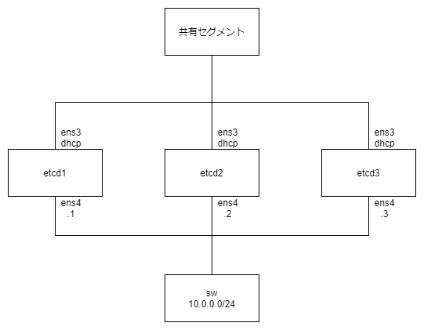

# etcd-on-sakuracloud

さくらのクラウドに etcd を構築する(お試し)。



## インスタンス作成

```bash
pushd terraform/

terraform plan | plan.txt
terraform apply plan.txt

popd
```

## etcd セットアップ

```bash
pushd ansible/

ansible-playbook --inventory ./sacloud-ansible-inventory.sh playbook.yml

popd
```

## etcd に接続する

etcd1 に ssh して etcdctl をたたく

```bash
ssh ubuntu@<etcd1のIP>
```

```bash
$ export ETCDCTL_API=3
$ HOST_1=10.0.0.1
$ HOST_2=10.0.0.2
$ HOST_3=10.0.0.3
$ ENDPOINTS=$HOST_1:2379,$HOST_2:2379,$HOST_3:2379
$ etcdctl --endpoints=$ENDPOINTS member list
ebca77937c587b, started, etcd1, http://10.0.0.1:2380, http://10.0.0.1:2379, false
400303631528c6ae, started, etcd2, http://10.0.0.2:2380, http://10.0.0.2:2379, false
f1c9a68550acc951, started, etcd3, http://10.0.0.3:2380, http://10.0.0.3:2379, false
```
