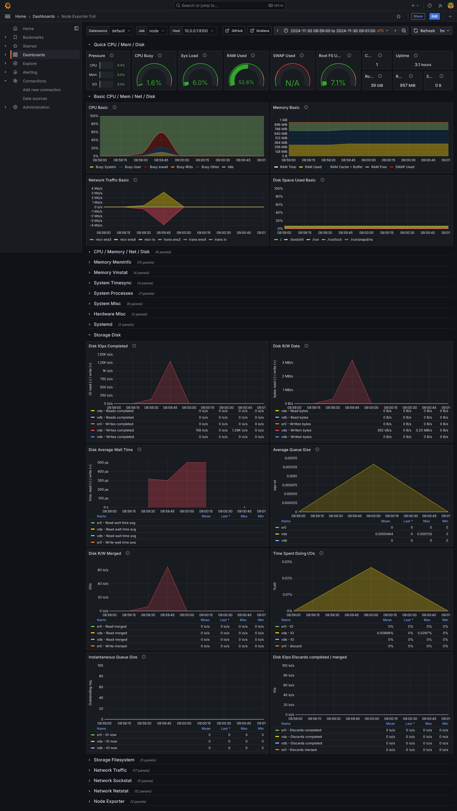

# etcd-on-sakuracloud

さくらのクラウドに etcd を構築する(お試し)。


## インスタンス作成

```bash
pushd terraform/

terraform plan | plan.txt
terraform apply plan.txt

popd
```

## etcd セットアップ

```bash
pushd ansible/

ansible-playbook --inventory ./sacloud-ansible-inventory.sh playbook.yml

popd
```

## etcd に接続する

etcd1 に ssh して etcdctl をたたく

```bash
ssh ubuntu@<etcd1のIP>
```

```bash
$ export ETCDCTL_API=3
$ HOST_1=10.0.0.1
$ HOST_2=10.0.0.2
$ HOST_3=10.0.0.3
$ ENDPOINTS=$HOST_1:2379,$HOST_2:2379,$HOST_3:2379
$ etcdctl --endpoints=$ENDPOINTS member list
ebca77937c587b, started, etcd1, http://10.0.0.1:2380, http://10.0.0.1:2379, false
400303631528c6ae, started, etcd2, http://10.0.0.2:2380, http://10.0.0.2:2379, false
f1c9a68550acc951, started, etcd3, http://10.0.0.3:2380, http://10.0.0.3:2379, false
```

## ベンチマーク

ベンチ用のサーバーに ssh します。

```bash
ssh ubuntu@<benchのIP>
```

### ベンチマークツールをインストールする

go でビルドするので golang-go をインストールします。

```
sudo apt update
sudo add-apt-repository ppa:longsleep/golang-backports
sudo apt install golang-go
```

go/bin のパスを通す

```
echo 'export PATH=$PATH;$HOME/go/bin' >> ~/.bashrc
source ~/.bashrc
```

ベンチマークツールをビルド・インストールする

```
git clone https://github.com/etcd-io/etcd
pushd etcd/
go install -v ./tools/benchmark
popd
```

### ベンチマークしてみる

事前準備

```bash
export ETCDCTL_API=3
HOST_1=10.0.0.1
HOST_2=10.0.0.2
HOST_3=10.0.0.3
ENDPOINTS=$HOST_1:2379,$HOST_2:2379,$HOST_3:2379
```

```bash
benchmark put --endpoints=$ENDPOINTS
```

<details>
    <summary>結果</summary>

```
2024/11/30 08:59:27 INFO: [core] [Channel #1 SubChannel #2]Subchannel Connectivity change to CONNECTING
2024/11/30 08:59:27 INFO: [core] [Channel #1 SubChannel #2]Subchannel picks a new address "10.0.0.1:2379" to connect
2024/11/30 08:59:27 INFO: [core] [Channel #1 SubChannel #2]Subchannel Connectivity change to READY
2024/11/30 08:59:27 INFO: [roundrobin] roundrobinPicker: Build called with info: {map[SubConn(id:2):{{Addr: "10.0.0.1:2379", ServerName: "10.0.0.1:2379", }}]}
2024/11/30 08:59:27 INFO: [core] [Channel #1]Channel Connectivity change to READY
10000 / 10000 [----------------------------------------------------------] 100.00% 684 p/s

Summary:
  Total:        14.8267 secs.
  Slowest:      0.0181 secs.
  Fastest:      0.0010 secs.
  Average:      0.0015 secs.
  Stddev:       0.0013 secs.
  Requests/sec: 674.4609

Response time histogram:
  0.0010 [1]    |
  0.0027 [9754] |∎∎∎∎∎∎∎∎∎∎∎∎∎∎∎∎∎∎∎∎∎∎∎∎∎∎∎∎∎∎∎∎∎∎∎∎∎∎∎∎
  0.0044 [94]   |
  0.0061 [13]   |
  0.0078 [13]   |
  0.0096 [15]   |
  0.0113 [22]   |
  0.0130 [34]   |
  0.0147 [28]   |
  0.0164 [20]   |
  0.0181 [6]    |

Latency distribution:
  10% in 0.0011 secs.
  25% in 0.0012 secs.
  50% in 0.0013 secs.
  75% in 0.0014 secs.
  90% in 0.0016 secs.
  95% in 0.0019 secs.
  99% in 0.0103 secs.
  99.9% in 0.0160 secs.
```



</details>

デフォルトでは gRPC のクライアントとコネクションは 1 で実行される。

### クライアント数を増やしてみる

#### クライアントを増やしてみる 10 個

```
benchmark put --endpoints=$ENDPOINTS --clients=10
```

<details>
    <summary>結果</summary>

```
2024/11/30 09:02:26 INFO: [core] [Channel #1 SubChannel #2]Subchannel Connectivity change to CONNECTING
2024/11/30 09:02:26 INFO: [core] [Channel #1 SubChannel #2]Subchannel picks a new address "10.0.0.1:2379" to connect
2024/11/30 09:02:26 INFO: [core] [Channel #1 SubChannel #2]Subchannel Connectivity change to READY
2024/11/30 09:02:26 INFO: [roundrobin] roundrobinPicker: Build called with info: {map[SubConn(id:2):{{Addr: "10.0.0.1:2379", ServerName: "10.0.0.1:2379", }}]}
2024/11/30 09:02:26 INFO: [core] [Channel #1]Channel Connectivity change to READY
10000 / 10000 [---------------------------------------------------------] 100.00% 2056 p/s

Summary:
  Total:        5.0650 secs.
  Slowest:      0.0576 secs.
  Fastest:      0.0012 secs.
  Average:      0.0051 secs.
  Stddev:       0.0090 secs.
  Requests/sec: 1974.3234

Response time histogram:
  0.0012 [1]    |
  0.0069 [9390] |∎∎∎∎∎∎∎∎∎∎∎∎∎∎∎∎∎∎∎∎∎∎∎∎∎∎∎∎∎∎∎∎∎∎∎∎∎∎∎∎
  0.0125 [71]   |
  0.0181 [36]   |
  0.0238 [12]   |
  0.0294 [20]   |
  0.0350 [30]   |
  0.0407 [55]   |
  0.0463 [207]  |
  0.0519 [146]  |
  0.0576 [32]   |

Latency distribution:
  10% in 0.0020 secs.
  25% in 0.0024 secs.
  50% in 0.0029 secs.
  75% in 0.0035 secs.
  90% in 0.0046 secs.
  95% in 0.0225 secs.
  99% in 0.0478 secs.
  99.9% in 0.0558 secs.
```


</details>

#### クライアントを増やしてみる 100 個

```
benchmark put --endpoints=$ENDPOINTS --clients=100
```

<details>
    <summary>結果</summary>

```
2024/11/30 09:05:22 INFO: [core] [Channel #1 SubChannel #2]Subchannel Connectivity change to CONNECTING
2024/11/30 09:05:22 INFO: [core] [Channel #1 SubChannel #2]Subchannel picks a new address "10.0.0.1:2379" to connect
2024/11/30 09:05:22 INFO: [core] [Channel #1 SubChannel #2]Subchannel Connectivity change to READY
2024/11/30 09:05:22 INFO: [roundrobin] roundrobinPicker: Build called with info: {map[SubConn(id:2):{{Addr: "10.0.0.1:2379", ServerName: "10.0.0.1:2379", }}]}
2024/11/30 09:05:22 INFO: [core] [Channel #1]Channel Connectivity change to READY
10000 / 10000 [--------------------------------------------------------] 100.00% 10552 p/s

Summary:
  Total:        1.1483 secs.
  Slowest:      0.0426 secs.
  Fastest:      0.0032 secs.
  Average:      0.0112 secs.
  Stddev:       0.0065 secs.
  Requests/sec: 8708.3773

Response time histogram:
  0.0032 [1]    |
  0.0071 [1294] |∎∎∎∎∎∎∎∎
  0.0111 [6190] |∎∎∎∎∎∎∎∎∎∎∎∎∎∎∎∎∎∎∎∎∎∎∎∎∎∎∎∎∎∎∎∎∎∎∎∎∎∎∎∎
  0.0150 [1183] |∎∎∎∎∎∎∎
  0.0190 [220]  |∎
  0.0229 [287]  |∎
  0.0268 [327]  |∎∎
  0.0308 [237]  |∎
  0.0347 [81]   |
  0.0387 [81]   |
  0.0426 [99]   |

Latency distribution:
  10% in 0.0068 secs.
  25% in 0.0079 secs.
  50% in 0.0091 secs.
  75% in 0.0111 secs.
  90% in 0.0207 secs.
  95% in 0.0268 secs.
  99% in 0.0385 secs.
  99.9% in 0.0425 secs.
```


</details>

1 秒ほどで終わったため、きれいにメトリクスが取れていない気がする。

デフォルトでは 10000 リクエスト送る。
これを増やして試してみる

#### クライアントとそうリクエスト数を増やしてみる 100 clients, 600000 requests

```
benchmark put --endpoints=$ENDPOINTS --clients=100 --total=600000
```

<details>
    <summary>結果</summary>

```
2024/11/30 09:11:28 INFO: [core] [Channel #1 SubChannel #2]Subchannel Connectivity change to CONNECTING
2024/11/30 09:11:28 INFO: [core] [Channel #1 SubChannel #2]Subchannel picks a new address "10.0.0.1:2379" to connect
2024/11/30 09:11:28 INFO: [core] [Channel #1 SubChannel #2]Subchannel Connectivity change to READY
2024/11/30 09:11:28 INFO: [roundrobin] roundrobinPicker: Build called with info: {map[SubConn(id:2):{{Addr: "10.0.0.1:2379", ServerName: "10.0.0.1:2379", }}]}
2024/11/30 09:11:28 INFO: [core] [Channel #1]Channel Connectivity change to READY
600000 / 600000 [-------------------------------------------------------] 100.00% 9048 p/s

Summary:
  Total:        66.5111 secs.
  Slowest:      0.0558 secs.
  Fastest:      0.0022 secs.
  Average:      0.0109 secs.
  Stddev:       0.0067 secs.
  Requests/sec: 9021.0566

Response time histogram:
  0.0022 [1]    |
  0.0076 [160668]       |∎∎∎∎∎∎∎∎∎∎∎∎∎∎∎∎∎∎
  0.0129 [341839]       |∎∎∎∎∎∎∎∎∎∎∎∎∎∎∎∎∎∎∎∎∎∎∎∎∎∎∎∎∎∎∎∎∎∎∎∎∎∎∎∎
  0.0183 [34777]        |∎∎∎∎
  0.0237 [17519]        |∎∎
  0.0290 [19336]        |∎∎
  0.0344 [15909]        |∎
  0.0397 [6377] |
  0.0451 [2071] |
  0.0504 [1389] |
  0.0558 [114]  |

Latency distribution:
  10% in 0.0064 secs.
  25% in 0.0075 secs.
  50% in 0.0087 secs.
  75% in 0.0106 secs.
  90% in 0.0191 secs.
  95% in 0.0280 secs.
  99% in 0.0369 secs.
  99.9% in 0.0480 secs.
```


</details>

以降総リクエスト数は 600000 でやる

#### クライアントを増やしてみる 200 clients, 600000 requests

```
benchmark put --endpoints=$ENDPOINTS --clients=200 --total=600000
```

<details>
    <summary>結果</summary>

```
2024/11/30 09:15:42 INFO: [core] [Channel #1 SubChannel #2]Subchannel Connectivity change to CONNECTING
2024/11/30 09:15:42 INFO: [core] [Channel #1 SubChannel #2]Subchannel picks a new address "10.0.0.1:2379" to connect
2024/11/30 09:15:42 INFO: [core] [Channel #1 SubChannel #2]Subchannel Connectivity change to READY
2024/11/30 09:15:42 INFO: [roundrobin] roundrobinPicker: Build called with info: {map[SubConn(id:2):{{Addr: "10.0.0.1:2379", ServerName: "10.0.0.1:2379", }}]}
2024/11/30 09:15:42 INFO: [core] [Channel #1]Channel Connectivity change to READY
600000 / 600000 [------------------------------------------------------] 100.00% 11612 p/s

Summary:
  Total:        51.8699 secs.
  Slowest:      0.2350 secs.
  Fastest:      0.0029 secs.
  Average:      0.0168 secs.
  Stddev:       0.0074 secs.
  Requests/sec: 11567.4113

Response time histogram:
  0.0029 [1]    |
  0.0261 [543921]       |∎∎∎∎∎∎∎∎∎∎∎∎∎∎∎∎∎∎∎∎∎∎∎∎∎∎∎∎∎∎∎∎∎∎∎∎∎∎∎∎
  0.0494 [55511]        |∎∎∎∎
  0.0726 [367]  |
  0.0958 [0]    |
  0.1190 [0]    |
  0.1422 [0]    |
  0.1654 [0]    |
  0.1886 [0]    |
  0.2118 [0]    |
  0.2350 [200]  |

Latency distribution:
  10% in 0.0109 secs.
  25% in 0.0128 secs.
  50% in 0.0152 secs.
  75% in 0.0185 secs.
  90% in 0.0256 secs.
  95% in 0.0304 secs.
  99% in 0.0381 secs.
  99.9% in 0.0490 secs.
```


</details>

#### クライアントを増やしてみる 300 clients, 600000 requests

```
benchmark put --endpoints=$ENDPOINTS --clients=300 --total=600000
```

<details>
    <summary>結果</summary>

```
2024/11/30 09:18:54 INFO: [core] [Channel #1 SubChannel #2]Subchannel Connectivity change to CONNECTING
2024/11/30 09:18:54 INFO: [core] [Channel #1 SubChannel #2]Subchannel picks a new address "10.0.0.1:2379" to connect
2024/11/30 09:18:54 INFO: [core] [Channel #1 SubChannel #2]Subchannel Connectivity change to READY
2024/11/30 09:18:54 INFO: [roundrobin] roundrobinPicker: Build called with info: {map[SubConn(id:2):{{Addr: "10.0.0.1:2379", ServerName: "10.0.0.1:2379", }}]}
2024/11/30 09:18:54 INFO: [core] [Channel #1]Channel Connectivity change to READY
600000 / 600000 [------------------------------------------------------] 100.00% 13757 p/s

Summary:
  Total:        43.8126 secs.
  Slowest:      0.0771 secs.
  Fastest:      0.0033 secs.
  Average:      0.0211 secs.
  Stddev:       0.0062 secs.
  Requests/sec: 13694.7061

Response time histogram:
  0.0033 [1]    |
  0.0107 [7667] |∎
  0.0181 [187494]       |∎∎∎∎∎∎∎∎∎∎∎∎∎∎∎∎∎∎∎∎∎∎∎∎∎
  0.0255 [297801]       |∎∎∎∎∎∎∎∎∎∎∎∎∎∎∎∎∎∎∎∎∎∎∎∎∎∎∎∎∎∎∎∎∎∎∎∎∎∎∎∎
  0.0328 [78423]        |∎∎∎∎∎∎∎∎∎∎
  0.0402 [19308]        |∎∎
  0.0476 [6419] |
  0.0549 [2406] |
  0.0623 [343]  |
  0.0697 [17]   |
  0.0771 [121]  |

Latency distribution:
  10% in 0.0147 secs.
  25% in 0.0172 secs.
  50% in 0.0201 secs.
  75% in 0.0238 secs.
  90% in 0.0284 secs.
  95% in 0.0326 secs.
  99% in 0.0432 secs.
  99.9% in 0.0531 secs.
```


</details>

#### クライアントを増やしてみる 400 clients, 600000 requests

```
benchmark put --endpoints=$ENDPOINTS --clients=400 --total=600000
```

<details>
    <summary>結果</summary>

```
2024/11/30 09:21:31 INFO: [core] [Channel #1 SubChannel #2]Subchannel Connectivity change to CONNECTING
2024/11/30 09:21:31 INFO: [core] [Channel #1 SubChannel #2]Subchannel picks a new address "10.0.0.1:2379" to connect
2024/11/30 09:21:31 INFO: [core] [Channel #1 SubChannel #2]Subchannel Connectivity change to READY
2024/11/30 09:21:31 INFO: [roundrobin] roundrobinPicker: Build called with info: {map[SubConn(id:2):{{Addr: "10.0.0.1:2379", ServerName: "10.0.0.1:2379", }}]}
2024/11/30 09:21:31 INFO: [core] [Channel #1]Channel Connectivity change to READY
600000 / 600000 [------------------------------------------------------] 100.00% 14944 p/s

Summary:
  Total:        40.3479 secs.
  Slowest:      0.3128 secs.
  Fastest:      0.0042 secs.
  Average:      0.0259 secs.
  Stddev:       0.0108 secs.
  Requests/sec: 14870.6627

Response time histogram:
  0.0042 [1]    |
  0.0350 [538581]       |∎∎∎∎∎∎∎∎∎∎∎∎∎∎∎∎∎∎∎∎∎∎∎∎∎∎∎∎∎∎∎∎∎∎∎∎∎∎∎∎
  0.0659 [59127]        |∎∎∎∎
  0.0968 [1891] |
  0.1276 [0]    |
  0.1585 [0]    |
  0.1893 [0]    |
  0.2202 [0]    |
  0.2511 [0]    |
  0.2819 [1]    |
  0.3128 [399]  |

Latency distribution:
  10% in 0.0176 secs.
  25% in 0.0203 secs.
  50% in 0.0243 secs.
  75% in 0.0292 secs.
  90% in 0.0352 secs.
  95% in 0.0404 secs.
  99% in 0.0562 secs.
  99.9% in 0.0822 secs.
```


</details>

#### クライアントを増やしてみる 500 clients, 600000 requests

```
benchmark put --endpoints=$ENDPOINTS --clients=500 --total=600000
```

<details>
    <summary>結果</summary>

```
2024/11/30 09:24:10 INFO: [core] [Channel #1 SubChannel #2]Subchannel Connectivity change to CONNECTING
2024/11/30 09:24:10 INFO: [core] [Channel #1 SubChannel #2]Subchannel picks a new address "10.0.0.1:2379" to connect
2024/11/30 09:24:10 INFO: [core] [Channel #1 SubChannel #2]Subchannel Connectivity change to READY
2024/11/30 09:24:10 INFO: [roundrobin] roundrobinPicker: Build called with info: {map[SubConn(id:2):{{Addr: "10.0.0.1:2379", ServerName: "10.0.0.1:2379", }}]}
2024/11/30 09:24:10 INFO: [core] [Channel #1]Channel Connectivity change to READY
600000 / 600000 [------------------------------------------------------] 100.00% 16195 p/s

Summary:
  Total:        37.2498 secs.
  Slowest:      0.1223 secs.
  Fastest:      0.0039 secs.
  Average:      0.0297 secs.
  Stddev:       0.0092 secs.
  Requests/sec: 16107.4708

Response time histogram:
  0.0039 [1]    |
  0.0157 [10319]        |∎
  0.0276 [267727]       |∎∎∎∎∎∎∎∎∎∎∎∎∎∎∎∎∎∎∎∎∎∎∎∎∎∎∎∎∎∎∎∎∎∎∎∎∎∎∎∎
  0.0394 [241222]       |∎∎∎∎∎∎∎∎∎∎∎∎∎∎∎∎∎∎∎∎∎∎∎∎∎∎∎∎∎∎∎∎∎∎∎∎
  0.0512 [66687]        |∎∎∎∎∎∎∎∎∎
  0.0631 [10669]        |∎
  0.0749 [2314] |
  0.0868 [539]  |
  0.0986 [272]  |
  0.1105 [57]   |
  0.1223 [193]  |

Latency distribution:
  10% in 0.0199 secs.
  25% in 0.0234 secs.
  50% in 0.0282 secs.
  75% in 0.0345 secs.
  90% in 0.0415 secs.
  95% in 0.0458 secs.
  99% in 0.0581 secs.
  99.9% in 0.0825 secs.

```


</details>

### クライアントを増やしてみる 1000 clients, 600000 requests

```
benchmark put --endpoints=$ENDPOINTS --clients=1000 --total=600000
```

<details>
    <summary>結果</summary>

```
2024/11/30 09:26:25 INFO: [core] [Channel #1 SubChannel #2]Subchannel Connectivity change to CONNECTING
2024/11/30 09:26:25 INFO: [core] [Channel #1 SubChannel #2]Subchannel picks a new address "10.0.0.1:2379" to connect
2024/11/30 09:26:25 INFO: [core] [Channel #1 SubChannel #2]Subchannel Connectivity change to READY
2024/11/30 09:26:25 INFO: [roundrobin] roundrobinPicker: Build called with info: {map[SubConn(id:2):{{Addr: "10.0.0.1:2379", ServerName: "10.0.0.1:2379", }}]}
2024/11/30 09:26:25 INFO: [core] [Channel #1]Channel Connectivity change to READY
600000 / 600000 [------------------------------------------------------] 100.00% 17619 p/s

Summary:
  Total:        34.2518 secs.
  Slowest:      0.1428 secs.
  Fastest:      0.0093 secs.
  Average:      0.0553 secs.
  Stddev:       0.0181 secs.
  Requests/sec: 17517.3300

Response time histogram:
  0.0093 [1]    |
  0.0227 [4696] |∎
  0.0360 [85623]        |∎∎∎∎∎∎∎∎∎∎∎∎∎∎∎∎∎∎∎∎
  0.0494 [147987]       |∎∎∎∎∎∎∎∎∎∎∎∎∎∎∎∎∎∎∎∎∎∎∎∎∎∎∎∎∎∎∎∎∎∎∎
  0.0627 [166163]       |∎∎∎∎∎∎∎∎∎∎∎∎∎∎∎∎∎∎∎∎∎∎∎∎∎∎∎∎∎∎∎∎∎∎∎∎∎∎∎∎
  0.0760 [124070]       |∎∎∎∎∎∎∎∎∎∎∎∎∎∎∎∎∎∎∎∎∎∎∎∎∎∎∎∎∎
  0.0894 [47377]        |∎∎∎∎∎∎∎∎∎∎∎
  0.1027 [16452]        |∎∎∎
  0.1161 [4897] |∎
  0.1294 [2043] |
  0.1428 [691]  |

Latency distribution:
  10% in 0.0329 secs.
  25% in 0.0417 secs.
  50% in 0.0542 secs.
  75% in 0.0665 secs.
  90% in 0.0781 secs.
  95% in 0.0871 secs.
  99% in 0.1062 secs.
  99.9% in 0.1317 secs.
```


</details>

#### クライアントを増やしてみる 2000 clients, 600000 requests

```
benchmark put --endpoints=$ENDPOINTS --clients=2000 --total=600000
```

<details>
    <summary>結果</summary>

```
2024/11/30 09:28:38 INFO: [core] [Channel #1 SubChannel #2]Subchannel Connectivity change to CONNECTING
2024/11/30 09:28:38 INFO: [core] [Channel #1 SubChannel #2]Subchannel picks a new address "10.0.0.1:2379" to connect
2024/11/30 09:28:38 INFO: [core] [Channel #1 SubChannel #2]Subchannel Connectivity change to READY
2024/11/30 09:28:38 INFO: [roundrobin] roundrobinPicker: Build called with info: {map[SubConn(id:2):{{Addr: "10.0.0.1:2379", ServerName: "10.0.0.1:2379", }}]}
2024/11/30 09:28:38 INFO: [core] [Channel #1]Channel Connectivity change to READY
600000 / 600000 [------------------------------------------------------] 100.00% 16105 p/s

Summary:
  Total:        37.4564 secs.
  Slowest:      0.5851 secs.
  Fastest:      0.0161 secs.
  Average:      0.1228 secs.
  Stddev:       0.0594 secs.
  Requests/sec: 16018.6269

Response time histogram:
  0.0161 [1]    |
  0.0730 [86580]        |∎∎∎∎∎∎∎∎∎∎∎
  0.1299 [294590]       |∎∎∎∎∎∎∎∎∎∎∎∎∎∎∎∎∎∎∎∎∎∎∎∎∎∎∎∎∎∎∎∎∎∎∎∎∎∎∎∎
  0.1868 [183571]       |∎∎∎∎∎∎∎∎∎∎∎∎∎∎∎∎∎∎∎∎∎∎∎∎
  0.2437 [16595]        |∎∎
  0.3006 [6870] |
  0.3575 [3384] |
  0.4144 [2327] |
  0.4713 [2467] |
  0.5282 [2068] |
  0.5851 [1547] |

Latency distribution:
  10% in 0.0658 secs.
  25% in 0.0894 secs.
  50% in 0.1172 secs.
  75% in 0.1427 secs.
  90% in 0.1674 secs.
  95% in 0.1974 secs.
  99% in 0.4209 secs.
  99.9% in 0.5578 secs.
```


</details>

#### クライアントを増やしてみる 3000 clients, 600000 requests

```
benchmark put --endpoints=$ENDPOINTS --clients=3000 --total=600000
```

<details>
    <summary>結果</summary>

```
2024/11/30 09:33:54 INFO: [core] [Channel #1 SubChannel #2]Subchannel Connectivity change to CONNECTING
2024/11/30 09:33:54 INFO: [core] [Channel #1 SubChannel #2]Subchannel picks a new address "10.0.0.1:2379" to connect
2024/11/30 09:33:54 INFO: [core] [Channel #1 SubChannel #2]Subchannel Connectivity change to READY
2024/11/30 09:33:54 INFO: [roundrobin] roundrobinPicker: Build called with info: {map[SubConn(id:2):{{Addr: "10.0.0.1:2379", ServerName: "10.0.0.1:2379", }}]}
2024/11/30 09:33:54 INFO: [core] [Channel #1]Channel Connectivity change to READY
600000 / 600000 [------------------------------------------------------] 100.00% 14045 p/s

Summary:
  Total:        42.9130 secs.
  Slowest:      0.8573 secs.
  Fastest:      0.0262 secs.
  Average:      0.2123 secs.
  Stddev:       0.1091 secs.
  Requests/sec: 13981.7871

Response time histogram:
  0.0262 [1]    |
  0.1093 [73513]        |∎∎∎∎∎∎∎∎∎∎∎∎
  0.1924 [243731]       |∎∎∎∎∎∎∎∎∎∎∎∎∎∎∎∎∎∎∎∎∎∎∎∎∎∎∎∎∎∎∎∎∎∎∎∎∎∎∎∎
  0.2755 [145886]       |∎∎∎∎∎∎∎∎∎∎∎∎∎∎∎∎∎∎∎∎∎∎∎
  0.3586 [67544]        |∎∎∎∎∎∎∎∎∎∎∎
  0.4417 [49116]        |∎∎∎∎∎∎∎∎
  0.5248 [13251]        |∎∎
  0.6080 [2398] |
  0.6911 [1478] |
  0.7742 [1429] |
  0.8573 [1653] |

Latency distribution:
  10% in 0.1036 secs.
  25% in 0.1375 secs.
  50% in 0.1860 secs.
  75% in 0.2597 secs.
  90% in 0.3691 secs.
  95% in 0.4213 secs.
  99% in 0.5713 secs.
  99.9% in 0.8480 secs.
```


</details>

2000 から 1000 よりも requests/sec が下がってきている

#### クライアントを増やす まとめ

10000 requests

| クライアント数 | requests/sec |
| -------------- | ------------ |
| 1              | 674.4609     |
| 10             | 1974.3234    |
| 100            | 8708.3773    |

600000 requests

| クライアント数 | requests/sec |
| -------------- | ------------ |
| 100            | 9021.0566    |
| 200            | 11567.4113   |
| 300            | 13694.7061   |
| 400            | 14870.6627   |
| 500            | 16107.4708   |
| 1000           | 17517.3300   |
| 2000           | 16018.6269   |
| 3000           | 13981.7871   |


