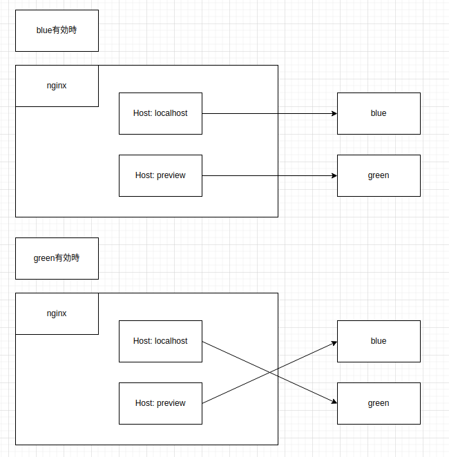

# nginx-blue-green

nginxでblue/greenデプロイメントを試す。

## 構成

本番用のvhostとpreview用のvhostを用意して、それぞれをblue, green環境にリバースプロキシする。
blueが本番のときは`/etc/nginx/conf.d/`に`blue.conf`, `green-preview.conf`を設置し、greenが本番のときは`green.conf`, `blue-preview.conf`を設置することで実現する。



## 検証項目

- [x] この構成でblue/greenデプロイメントができるか
- [x] 切り替えタイミングで既存の通信はどうなるか

## この構成でblue/greenデプロイメントができるか

### 結果

うまくblue/greenデプロイメントができた。
また、スクリプト化しておくことで切り替えや現在のデプロイ状況がかんたんに行えた。

### 実行ログ

nginxとアプリケーションのコンテナを起動する。

```bash
$ docker compose up -d
[+] Running 4/4
 ✔ Network nginx-blue-green_default    Created         0.1s 
 ✔ Container nginx-blue-green-blue-1   Started         0.9s 
 ✔ Container nginx-blue-green-nginx-1  Started         0.8s 
 ✔ Container nginx-blue-green-green-1  Started         0.9s 
```

動作していることを確認

```
$ docker compose ps
NAME                       IMAGE                    COMMAND                   SERVICE   CREATED          STATUS          PORTS
nginx-blue-green-blue-1    nginx-blue-green-blue    "/app/app"                blue      43 seconds ago   Up 43 seconds   
nginx-blue-green-green-1   nginx-blue-green-green   "/app/app"                green     43 seconds ago   Up 42 seconds   
nginx-blue-green-nginx-1   nginx                    "/docker-entrypoint.…"   nginx     43 seconds ago   Up 43 seconds   0.0.0.0:8080->80/tcp, :::8080->80/tcp
```

この時点では`/etc/nginx/conf.d/default.conf`だけが存在するので初期ページが表示される

```
$ curl localhost:8080
<!DOCTYPE html>
<html>
<head>
<title>Welcome to nginx!</title>
<style>
html { color-scheme: light dark; }
body { width: 35em; margin: 0 auto;
font-family: Tahoma, Verdana, Arial, sans-serif; }
</style>
</head>
<body>
<h1>Welcome to nginx!</h1>
<p>If you see this page, the nginx web server is successfully installed and
working. Further configuration is required.</p>

<p>For online documentation and support please refer to
<a href="http://nginx.org/">nginx.org</a>.<br/>
Commercial support is available at
<a href="http://nginx.com/">nginx.com</a>.</p>

<p><em>Thank you for using nginx.</em></p>
</body>
</html>
```

default.confを削除しblue.confとgreen-preview.confを設置するスクリプトを実行

```
$ docker compose exec --workdir /etc/nginx/scripts/ nginx bash bg-init.sh
2024/07/18 19:15:46 [notice] 42#42: signal process started
```

curl-release.shでblue、curl-preview.shでgreenが表示されることを確認

```
$ bash ./curl-release.sh
blue
$ bash ./curl-preview.sh
green
```

releaseをgreenにする

```
$ docker compose exec --workdir /etc/nginx/scripts/ nginx bash bg-change.sh
blue -> green
2024/07/18 19:18:26 [notice] 58#58: signal process started
```

curl-release.shでgreen, curel-preview.shでblueが表示されることを確認

```
$ bash ./curl-release.sh
green
$ bash ./curl-preview.sh 
blue
```

## 切り替えタイミングで既存の通信はどうなるか

バックエンドのアプリケーションはクエリパラメータで渡したdurationだけsleepしてからレスポンスを返すように実装している。

release: blue, preview: greenの状態で10s sleepするリクエストを送り、その間に切り替える。

### 結果

nginxがうまいこと切り替え前のリクエストはそのまま処理し、切り替え後のリクエストは新しいプロセスで処理していることがわかった。

### 実行ログ

blueがreleaseの状態で行う
```
$ docker compose exec --workdir /etc/nginx/scripts/ nginx bash bg-current.sh
blue
```

ターミナル1(sleepしているので待ち状態になる)
```
$ bash ./curl-release.sh 10s

```

切り替えてcurl-release.shを実行する
```
$ docker compose exec --workdir /etc/nginx/scripts/ nginx bash bg-change.sh
2024/07/18 19:25:32 [notice] 95#95: signal process started
$ bash ./curl-release.sh
green
```

ターミナル1の実行から10秒後切り替え前のblueのレスポンスが表示される
```
$ bash ./curl-release.sh 10s
blue
```